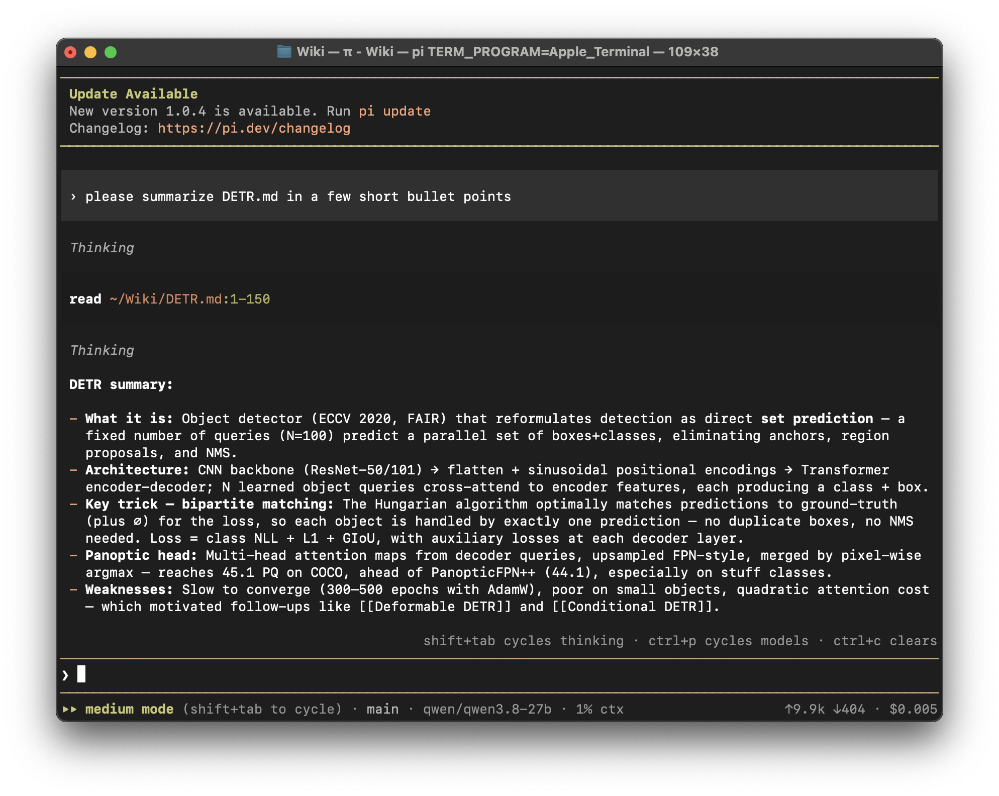

# pi-claude-code-skin

A [pi](https://github.com/earendil-works/pi) package that restyles the interactive agent to look
like Claude Code: pixel-invader header, `|` banner lines, right-aligned hint above the input,
a `❯` prompt between full-width rules, a `▸▸ mode (shift+tab to cycle)` footer, and a
clay/charcoal palette with a gray user-message bar.

<p align="center">
  
</p>

## Install

```bash
pi install git:github.com/Krystex/pi-claude-code-skin
# pin a ref: pi install git:github.com/Krystex/pi-claude-code-skin@v0.1.0
# remove:    pi remove git:github.com/Krystex/pi-claude-code-skin
```

The skin activates the `claude-code` palette itself at session start (in memory), so your
`/settings` → Theme choice is never rewritten. Select `claude-code` in `/settings` to make it
permanent even when the skin is off.

## Controls

| Command | Effect |
| --- | --- |
| `/claude-code on` | apply header, footer, hint, editor prompt, spinner, theme |
| `/claude-code off` | restore pi's built-in header, footer, editor, and indicators |
| `/claude-code status` | report the current state |

## Customizing

* **Words/identity** — `CONFIG` at the top of `extensions/claude-code.ts` (`appName`,
  `version`, `planLabel`, `banner`, `hint`, `prompt`, `workingMessage`, `spinnerFrames`,
  `messagePrefix`).
* **Colors** — only `themes/claude-code.json`. Everything is a `vars` entry (`clay`,
  `panelHi`, `grayDim`, …), so changing `"clay": "#d97757"` re-skins logo, prompt accents,
  bullets, and borders at once. Hex, `oklch()`, `okhsl()`, 256-color indices, and `""` are
  all accepted.

## Development

```bash
git clone https://github.com/Krystex/pi-claude-code-skin
cd pi-claude-code-skin
npm install
pi install .          # local package source: files load in place, no copy
npm run check         # tsc --noEmit
```

Edit `extensions/claude-code.ts` or `themes/claude-code.json`, then `/reload` (or restart pi)
to pick the change up. Remove with `pi remove <path-to-this-folder>`.

`@earendil-works/pi-coding-agent` and `@earendil-works/pi-tui` are dev-only (`peerDependencies`
with `"*"`): pi supplies the host packages to extensions at runtime, so nothing is bundled.
